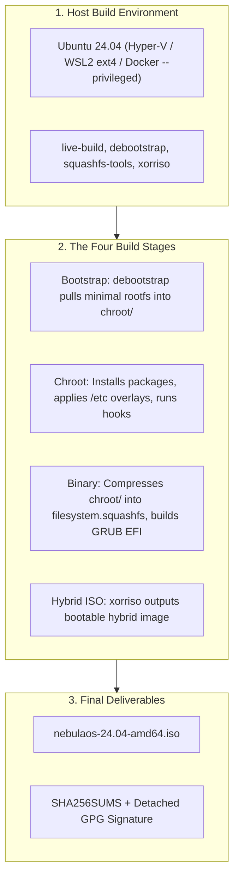

# NebulaOS: Complete All-in-One Build Blueprint & Engineering Reference
### Build a Custom Ubuntu 24.04 LTS (Noble Numbat) Live & Installable DevOps Distro from Scratch

---

## Document Overview
This document is a comprehensive, standalone educational reference and master guide to building **NebulaOS v0.1.0** entirely **from scratch**. 

**No "one-click" blackbox shell scripts are used to generate the ISO.** Every single file, directory, configuration flag, package list, chroot hook, and Calamares installer setting is explicitly documented and constructed step-by-step so you learn the inner workings of Linux distribution engineering and Debian `live-build`.

---

## Table of Contents
1. [Distro Architecture & Technical Specification](#1-distro-architecture--technical-specification)
2. [Build Host Environments: Hyper-V, WSL2, and Docker](#2-build-host-environments-hyper-v-wsl2-and-docker)
3. [Phase 1: Environment Setup & Toolchain Understanding (Day 1–2)](#3-phase-1-environment-setup--toolchain-understanding-day-12)
4. [Phase 2: Minimal Live Boot Configuration & Test Build (Day 3–4)](#4-phase-2-minimal-live-boot-configuration--test-build-day-34)
5. [Phase 3: DevOps Toolchain & Third-Party Repositories (Day 5)](#5-phase-3-devops-toolchain--third-party-repositories-day-5)
6. [Phase 4: Distro Identity & Visual Branding (Day 6–7)](#6-phase-4-distro-identity--visual-branding-day-67)
7. [Phase 5: User Provisioning & Chroot Hooks (Day 8–9)](#7-phase-5-user-provisioning--chroot-hooks-day-89)
8. [Phase 6: Calamares Graphical Installer Pipeline (Day 10)](#8-phase-6-calamares-graphical-installer-pipeline-day-10)
9. [Phase 7: Custom Repositories & Offline Readiness (Day 11)](#9-phase-7-custom-repositories--offline-readiness-day-11)
10. [Phase 8: Hardening, Secure Boot & USB Persistence (Day 12)](#10-phase-8-hardening-secure-boot--usb-persistence-day-12)
11. [Phase 9: Comprehensive QA Testing Matrix & Troubleshooting (Day 13)](#11-phase-9-comprehensive-qa-testing-matrix--troubleshooting-day-13)
12. [Phase 10: Release Engineering, GPG Signing & Distribution (Day 14)](#12-phase-10-release-engineering-gpg-signing--distribution-day-14)

---

## 1. Distro Architecture & Technical Specification

| Property | Value | Rationale |
| :--- | :--- | :--- |
| **Distro Name** | **NebulaOS** | Independent branding replacing all Ubuntu logos and references |
| **Base OS** | **Ubuntu 24.04 LTS (Noble Numbat)** | 5-year LTS kernel (6.8+) and glibc compatibility |
| **Build Engine** | **Debian `live-build`** | The industry standard for declarative Debian/Ubuntu live ISO generation |
| **Live Initramfs**| **Casper** | Ubuntu's live-boot engine that mounts `filesystem.squashfs` with overlayfs |
| **Desktop Environment** | **XFCE 4.18 (LightDM)** | Lightweight (< 500 MB RAM idle), rock solid, ideal for DevOps workstations |
| **Installer** | **Calamares 3.3+** | Modular Qt graphical installer supporting GPT/EFI and LUKS disk encryption |
| **Cloud/DevOps Stack** | Docker CE, kubectl v1.31, Terraform, Helm v3, Ansible | Native upstream vendor repositories with pre-configured non-root access |
| **Boot Architecture** | UEFI (Secure Boot) + BIOS Hybrid | Microsoft-signed Canonical shim (`shimx64.efi`) and GRUB EFI |
| **Persistence** | Casper Persistence (`casper-rw`) | Live USB changes survive reboots without full installation |
| **Default User** | `nebula` (password: `nebula`) | Passwordless sudo in the live evaluation session |



---

## 2. Build Host Environments: Hyper-V, WSL2, and Docker

Choose one of the following build host environments based on your current setup:

### Option A: Hyper-V Virtual Machine (Recommended)
Building in a dedicated virtual machine gives you a full native Linux kernel, direct loopback device access, and zero container/filesystem translation quirks.
1. Open **Hyper-V Manager** on Windows.
2. Create a **Generation 2** VM:
   - Operating System: Ubuntu 24.04 LTS Server or Desktop ISO.
   - Memory: 4096 MB (4 GB RAM minimum).
   - Hard Disk: 30 GB minimum (VHDX).
   - Processors: 2 or 4 vCPUs.
3. Once Ubuntu is installed, boot into it and open the terminal.

### Option B: WSL2 (Windows Subsystem for Linux)
WSL2 is fast and convenient, but you must respect Linux POSIX permissions:

> [!CAUTION]
> **CRITICAL WSL2 PATH WARNING:**
> **DO NOT build inside `/mnt/c/`, `/mnt/f/`, or any Windows-mounted drive.**
> The Windows 9P / DrvFs translation filesystem cannot create Linux device nodes (`mknod`), UNIX sockets, or chroot symlinks. Doing so will cause `debootstrap` to fail with `operation not permitted`.
>
> **Always build inside the WSL2 native ext4 path:**
> ```bash
> cd ~
> mkdir -p nebulaos-build && cd nebulaos-build
> ```

### Option C: Docker Container
If building inside Docker, pass `--privileged` so `live-build` can manage `/dev/loop*` loopback devices to compress SquashFS images:
```bash
docker run --privileged -it \
    --name nebulaos-builder \
    -v ${PWD}:/build \
    -w /build \
    ubuntu:24.04 bash
```

---

## 3. Phase 1: Environment Setup & Toolchain Understanding (Day 1–2)

### Step 1.1: Install Host Toolchain
Run these commands inside your build terminal:

```bash
# Update APT index
sudo apt update

# Install live-build, bootstrap tooling, and ISO mastering utilities
sudo apt install -y \
    live-build \
    debootstrap \
    squashfs-tools \
    xorriso \
    grub-pc-bin \
    grub-efi-amd64-bin \
    mtools \
    dosfstools \
    git \
    curl \
    gnupg \
    coreutils

# Create your dedicated project directory
mkdir -p ~/nebulaos-build
cd ~/nebulaos-build
```

### Step 1.2: Understanding `live-build`'s Anatomy
`live-build` works with two primary directories:
- `auto/`: Contains helper wrapper scripts (`auto/config`, `auto/build`, `auto/clean`) that define flags so you never have to re-type a long command.
- `config/`: The declarative configuration tree containing package manifests, root overlays, third-party repositories, and chroot hooks.

### Step 1.3: Manually Creating the `auto/` Configuration Scripts
Inside `~/nebulaos-build`, create the `auto/` folder and manually define your build flags:

```bash
mkdir -p auto

# 1. auto/config: Specifies exact parameters passed to lb config
cat << 'EOF' > auto/config
#!/bin/sh
set -e

lb config noauto \
    --mode ubuntu \
    --distribution noble \
    --architectures amd64 \
    --archive-areas "main restricted universe multiverse" \
    --linux-flavours generic \
    --bootloaders "grub-efi" \
    --binary-images iso-hybrid \
    --memtest none \
    --iso-application "NebulaOS Live & Installable DevOps Distro" \
    --iso-publisher "NebulaOS Project <https://nebulaos.dev>" \
    --iso-volume "NEBULAOS_2404" \
    --parent-mirror-bootstrap "http://archive.ubuntu.com/ubuntu/" \
    --parent-mirror-chroot "http://archive.ubuntu.com/ubuntu/" \
    --parent-mirror-binary "http://archive.ubuntu.com/ubuntu/" \
    --mirror-bootstrap "http://archive.ubuntu.com/ubuntu/" \
    --mirror-chroot "http://archive.ubuntu.com/ubuntu/" \
    --mirror-binary "http://archive.ubuntu.com/ubuntu/" \
    "${@}"
EOF
chmod +x auto/config

# 2. auto/build: Wraps lb build and logs output to build.log
cat << 'EOF' > auto/build
#!/bin/sh
set -e

lb build "${@}" 2>&1 | tee build.log
EOF
chmod +x auto/build

# 3. auto/clean: Purges previous chroot artifacts safely
cat << 'EOF' > auto/clean
#!/bin/sh
set -e

lb clean --purge "${@}"
rm -f build.log
EOF
chmod +x auto/clean
```

---

## 4. Phase 2: Minimal Live Boot Configuration & Test Build (Day 3–4)

Before adding heavy desktop packages or the DevOps toolchain, we build and validate a minimal live base system. This proves that network mirrors, `debootstrap`, kernel initramfs generation, and Casper live discovery work cleanly.

### Step 2.1: Create Minimal Package Manifest
In `live-build`, any file inside `config/package-lists/` ending in `.list.chroot` will be installed during the chroot stage.

```bash
mkdir -p config/package-lists
mkdir -p config/includes.chroot/etc/apt/apt.conf.d

cat << 'EOF' > config/package-lists/minimal.list.chroot
# Core Linux Kernel & Live Boot Engine
casper
discover
laptop-detect
os-prober
linux-generic

# Init System & Base Utilities
systemd
systemd-sysv
dbus
sudo
network-manager
net-tools
iproute2
iputils-ping
curl
wget
ca-certificates
nano
less
pciutils
usbutils
locales
tzdata
EOF

# Disable automatic recommended package installation to prevent ISO bloat
echo 'APT::Install-Recommends "false";' > config/includes.chroot/etc/apt/apt.conf.d/99recommends
```

### Step 2.2: Execute the Minimal Build
```bash
# 1. Clean previous state
sudo lb clean --purge

# 2. Generate config tree
sudo lb config

# 3. Build the minimal test ISO
sudo lb build 2>&1 | tee build.log
```

### Step 2.3: Validate the Test Boot in a VM
When `lb build` completes, `live-image-amd64.hybrid.iso` is generated.
Rename it:
```bash
mv live-image-amd64.hybrid.iso nebulaos-24.04-minimal-amd64.iso
```
Test this ISO in QEMU, VirtualBox, or Hyper-V:
- **Pass Criteria**: The GRUB menu loads, Casper searches for and mounts the live filesystem without kernel panic, and drops you into a shell or login prompt.

---

## 5. Phase 3: DevOps Toolchain & Third-Party Repositories (Day 5)

Now that the base live system is proven, we configure third-party vendor repositories for **Docker CE**, **Kubernetes (`kubectl`)**, **Terraform**, and **Helm**.

In `live-build`:
- `config/archives/<name>.list.chroot`: Contains the APT repository source line.
- `config/archives/<name>.key.chroot`: Contains the ASCII-armored GPG public key.

### Step 3.1: Configure Repositories & GPG Keys Manually
```bash
mkdir -p config/archives

# 1. Docker Official Repository
echo "deb [arch=amd64] https://download.docker.com/linux/ubuntu noble stable" \
    > config/archives/docker.list.chroot
curl -fsSL https://download.docker.com/linux/ubuntu/gpg \
    > config/archives/docker.key.chroot

# 2. Kubernetes Official Repository (v1.31)
echo "deb [arch=amd64] https://pkgs.k8s.io/core:/stable:/v1.31/deb/ /" \
    > config/archives/kubernetes.list.chroot
curl -fsSL https://pkgs.k8s.io/core:/stable:/v1.31/deb/Release.key \
    > config/archives/kubernetes.key.chroot

# 3. HashiCorp Official Repository (Terraform)
echo "deb [arch=amd64] https://apt.releases.hashicorp.com noble main" \
    > config/archives/hashicorp.list.chroot
curl -fsSL https://apt.releases.hashicorp.com/gpg \
    > config/archives/hashicorp.key.chroot

# 4. Helm Official Repository
echo "deb [arch=amd64] https://baltocdn.com/helm/stable/debian/ all main" \
    > config/archives/helm.list.chroot
curl -fsSL https://baltocdn.com/helm/signing.asc \
    > config/archives/helm.key.chroot
```

### Step 3.2: Create Desktop, DevOps, and Installer Package Lists
```bash
# 1. Desktop Environment (XFCE4 & LightDM)
cat << 'EOF' > config/package-lists/desktop.list.chroot
xfce4
xfce4-terminal
xfce4-taskmanager
thunar
mousepad
lightdm
lightdm-gtk-greeter
network-manager-gnome
pulseaudio
pavucontrol
firefox
zenity
EOF

# 2. DevOps & Cloud Engineering Stack
cat << 'EOF' > config/package-lists/devops.list.chroot
docker-ce
docker-ce-cli
containerd.io
docker-buildx-plugin
docker-compose-plugin
kubectl
terraform
helm
ansible
git
curl
wget
jq
yq
tmux
htop
vim
nano
zsh
python3-pip
python3-venv
build-essential
tree
unzip
rsync
openssh-client
nmap
traceroute
tcpdump
net-tools
dnsutils
iproute2
wireguard-tools
EOF

# 3. Calamares Installer & Disk Partitioning Tools
cat << 'EOF' > config/package-lists/installer.list.chroot
calamares
gparted
parted
dosfstools
e2fsprogs
btrfs-progs
xfsprogs
EOF
```

---

## 6. Phase 4: Distro Identity & Visual Branding (Day 6–7)

Files placed inside `config/includes.chroot/` are copied directly into the target filesystem root (`/`) during build.

### Step 4.1: OS Identity & Release Files
```bash
mkdir -p config/includes.chroot/etc/profile.d
mkdir -p config/includes.chroot/usr/share/backgrounds/nebulaos
mkdir -p config/includes.chroot/usr/share/pixmaps

# Set Operating System metadata for hostnamectl, fastfetch, and Calamares
cat << 'EOF' > config/includes.chroot/etc/os-release
NAME="NebulaOS"
VERSION="24.04 LTS (Noble Numbat)"
ID=nebulaos
ID_LIKE="ubuntu debian"
PRETTY_NAME="NebulaOS 24.04 LTS (DevOps Workstation)"
VERSION_ID="24.04"
HOME_URL="https://nebulaos.dev"
SUPPORT_URL="https://nebulaos.dev/support"
BUG_REPORT_URL="https://github.com/nebulaos/nebulaos/issues"
PRIVACY_POLICY_URL="https://nebulaos.dev/privacy"
VERSION_CODENAME=noble
UBUNTU_CODENAME=noble
LOGO=nebulaos-logo
EOF

cat << 'EOF' > config/includes.chroot/etc/issue
NebulaOS 24.04 LTS \n \l

EOF
cp config/includes.chroot/etc/issue config/includes.chroot/etc/issue.net
```

### Step 4.2: Engineer MOTD & Dynamic Git Prompt
```bash
# 1. Custom Message of the Day
cat << 'EOF' > config/includes.chroot/etc/motd
  _   _      _             _         ___  ____  
 | \ | | ___| |__  _   _  | | __ _  / _ \/ ___| 
 |  \| |/ _ \ '_ \| | | | | |/ _` || | | \___ \ 
 | |\  |  __/ |_) | |_| | | | (_| || |_| |___) |
 |_| \_|\___|_.__/ \__,_| |_|\__,_| \___/|____/ 
 NebulaOS 24.04 LTS — Cloud & DevOps Workstation

 Available DevOps Tooling:
   docker    : $(docker --version 2>/dev/null || echo "installed")
   kubectl   : $(kubectl version --client --output=yaml 2>/dev/null | grep gitVersion | awk '{print $2}' || echo "installed")
   terraform : $(terraform version 2>/dev/null | head -n1 || echo "installed")
   helm      : $(helm version --short 2>/dev/null || echo "installed")
   ansible   : $(ansible --version 2>/dev/null | head -n1 || echo "installed")

 Double-click 'Install NebulaOS' on the desktop to install permanently.
EOF

# 2. Dynamic Git-Aware Shell Prompt
cat << 'EOF' > config/includes.chroot/etc/profile.d/nebulaos-prompt.sh
parse_git_branch() {
    git branch 2> /dev/null | sed -e '/^[^*]/d' -e 's/* \(.*\)/ (\1)/'
}
if [ "$USER" = "root" ]; then
    PS1='\[\033[01;31m\]\u@\h\[\033[00m\]:\[\033[01;34m\]\w\[\033[01;33m\]$(parse_git_branch)\[\033[00m\]# '
else
    PS1='\[\033[01;36m\]\u@nebulaos\[\033[00m\]:\[\033[01;34m\]\w\[\033[01;33m\]$(parse_git_branch)\[\033[00m\]$ '
fi
EOF
chmod +x config/includes.chroot/etc/profile.d/nebulaos-prompt.sh
```

### Step 4.3: Vector SVG Wallpaper
```bash
cat << 'EOF' > config/includes.chroot/usr/share/backgrounds/nebulaos/nebulaos-wallpaper.svg
<svg xmlns="http://www.w3.org/2000/svg" width="1920" height="1080" viewBox="0 0 1920 1080">
  <defs>
    <linearGradient id="bg" x1="0%" y1="0%" x2="100%" y2="100%">
      <stop offset="0%" stop-color="#0a0e17" />
      <stop offset="50%" stop-color="#111927" />
      <stop offset="100%" stop-color="#0f172a" />
    </linearGradient>
    <linearGradient id="accent" x1="0%" y1="0%" x2="100%" y2="0%">
      <stop offset="0%" stop-color="#00f2fe" />
      <stop offset="100%" stop-color="#4facfe" />
    </linearGradient>
  </defs>
  <rect width="1920" height="1080" fill="url(#bg)" />
  <circle cx="960" cy="540" r="320" fill="none" stroke="url(#accent)" stroke-width="2" opacity="0.3" />
  <circle cx="960" cy="540" r="260" fill="none" stroke="url(#accent)" stroke-width="1.5" stroke-dasharray="10 15" opacity="0.4" />
  <text x="960" y="530" font-family="sans-serif" font-size="64" font-weight="bold" fill="#ffffff" text-anchor="middle" letter-spacing="4">NebulaOS</text>
  <text x="960" y="580" font-family="sans-serif" font-size="20" fill="#00f2fe" text-anchor="middle" letter-spacing="8">CLOUD &amp; DEVOPS WORKSTATION</text>
</svg>
EOF

cp config/includes.chroot/usr/share/backgrounds/nebulaos/nebulaos-wallpaper.svg \
   config/includes.chroot/usr/share/pixmaps/nebulaos-logo.svg
```

### Step 4.4: Calamares Visual Branding
```bash
mkdir -p config/includes.chroot/etc/calamares/branding/nebulaos/slideshow

cat << 'EOF' > config/includes.chroot/etc/calamares/branding/nebulaos/branding.desc
---
componentName: nebulaos
welcomeStyleCalamares: false
welcomeExpandingLogo: true
windowExpanding: normal
windowSize: 850px,560px
windowPlacement: center

strings:
    productName:         "NebulaOS"
    shortProductName:    "NebulaOS"
    version:             "24.04 LTS"
    shortVersion:        "24.04"
    versionedName:       "NebulaOS 24.04 LTS"
    shortVersionedName:  "NebulaOS 24.04"
    bootloaderEntryName: "NebulaOS"
    productUrl:          "https://nebulaos.dev"
    supportUrl:          "https://nebulaos.dev/support"
    bugReportUrl:        "https://github.com/nebulaos/nebulaos/issues"
    releaseNotesUrl:     "https://nebulaos.dev/releases/24.04"

images:
    productLogo:         "nebulaos-logo.svg"
    productIcon:         "nebulaos-logo.svg"
    productWelcome:      "nebulaos-logo.svg"

slideshow:               "slideshow.qml"

style:
   SidebarBackground:    "#0a0e17"
   SidebarText:          "#ffffff"
   SidebarTextCurrent:   "#00f2fe"
   SidebarBackgroundCurrent: "#111927"
EOF

cat << 'EOF' > config/includes.chroot/etc/calamares/branding/nebulaos/stylesheet.qss
QWidget {
    background-color: #0f172a;
    color: #e2e8f0;
    font-family: "DejaVu Sans";
    font-size: 13px;
}
QDialog, QMainWindow { background-color: #0a0e17; }
#sidebarApp { background-color: #0a0e17; border-right: 1px solid #1e293b; padding: 12px; }
QPushButton {
    background-color: #1e293b; border: 1px solid #334155; border-radius: 4px;
    padding: 8px 18px; color: #ffffff; font-weight: bold;
}
QPushButton:hover { background-color: #00f2fe; color: #0a0e17; border: 1px solid #00f2fe; }
QPushButton:pressed { background-color: #0284c7; color: #ffffff; }
QProgressBar { background-color: #1e293b; border: 1px solid #334155; border-radius: 4px; text-align: center; color: #ffffff; height: 18px; }
QProgressBar::chunk { background-color: #00f2fe; border-radius: 3px; }
QLineEdit, QComboBox { background-color: #1e293b; border: 1px solid #334155; border-radius: 4px; padding: 6px; color: #ffffff; }
QLineEdit:focus, QComboBox:focus { border: 1px solid #00f2fe; }
EOF

cat << 'EOF' > config/includes.chroot/etc/calamares/branding/nebulaos/slideshow/slide1.html
<!DOCTYPE html>
<html>
<head><style>body { background-color: #0f172a; color: #f8fafc; font-family: sans-serif; padding: 40px; } h1 { color: #00f2fe; font-size: 30px; }</style></head>
<body>
  <h1>Welcome to NebulaOS</h1>
  <p>A specialized workstation engineered for DevOps practitioners, Cloud Architects, and SREs.</p>
</body>
</html>
EOF

cp config/includes.chroot/usr/share/backgrounds/nebulaos/nebulaos-wallpaper.svg \
   config/includes.chroot/etc/calamares/branding/nebulaos/nebulaos-logo.svg
```

---

## 7. Phase 5: User Provisioning & Chroot Hooks (Day 8–9)

Scripts placed in `config/hooks/live/*.hook.chroot` execute inside the target rootfs during the final phase of the chroot stage.

### Step 5.1: Live User, Docker Permissions, and LightDM Auto-Login
```bash
mkdir -p config/hooks/live

cat << 'EOF' > config/hooks/live/01-user-setup.hook.chroot
#!/bin/sh
set -e
echo "=== NebulaOS Hook: Configuring Live User ==="

# 1. Create user nebula
if ! id -u nebula >/dev/null 2>&1; then
    useradd -m -s /bin/bash -c "NebulaOS Live User" -G sudo,adm,dialout,cdrom,plugdev,netdev nebula
    echo "nebula:nebula" | chpasswd
fi

# 2. Add user to docker group
groupadd -f docker
usermod -aG docker nebula

# 3. Passwordless sudo for live session
mkdir -p /etc/sudoers.d
echo "nebula ALL=(ALL) NOPASSWD: ALL" > /etc/sudoers.d/99-nebula-live
chmod 0440 /etc/sudoers.d/99-nebula-live

# 4. LightDM autologin
mkdir -p /etc/lightdm/lightdm.conf.d
cat << 'LIGHTDM_EOF' > /etc/lightdm/lightdm.conf.d/80-nebula-autologin.conf
[Seat:*]
autologin-user=nebula
autologin-user-timeout=0
user-session=xfce
LIGHTDM_EOF
EOF
chmod +x config/hooks/live/01-user-setup.hook.chroot
```

### Step 5.2: Service Daemons Hook
```bash
cat << 'EOF' > config/hooks/live/02-services-setup.hook.chroot
#!/bin/sh
set -e
echo "=== NebulaOS Hook: Enabling System Daemons ==="

systemctl enable NetworkManager.service || true
systemctl enable docker.service || true
systemctl enable containerd.service || true
systemctl enable lightdm.service || true
systemctl mask sleep.target suspend.target hibernate.target hybrid-sleep.target || true
EOF
chmod +x config/hooks/live/02-services-setup.hook.chroot
```

### Step 5.3: Welcome Experience & Desktop Shortcut
```bash
mkdir -p config/includes.chroot/etc/skel/Desktop
mkdir -p config/includes.chroot/usr/local/bin
mkdir -p config/includes.chroot/etc/systemd/system

# 1. Desktop Launcher for Calamares
cat << 'EOF' > config/includes.chroot/etc/skel/Desktop/install-nebulaos.desktop
[Desktop Entry]
Type=Application
Version=1.0
Name=Install NebulaOS
GenericName=Live System Installer
Comment=Install NebulaOS permanently to your hard disk
Exec=pkexec calamares
Icon=calamares
Terminal=false
Categories=System;
StartupNotify=true
EOF
chmod +x config/includes.chroot/etc/skel/Desktop/install-nebulaos.desktop

# 2. Welcome Dialog Script
cat << 'EOF' > config/includes.chroot/usr/local/bin/nebulaos-welcome.sh
#!/bin/bash
if [ -f /var/run/nebulaos-welcomed ]; then exit 0; fi
touch /var/run/nebulaos-welcomed
if [ -n "$DISPLAY" ] && command -v zenity >/dev/null 2>&1; then
    zenity --info --title="Welcome to NebulaOS 24.04 LTS" \
        --width=450 --height=220 \
        --text="<b>Welcome to NebulaOS!</b>\n\nYour specialized DevOps & Cloud Engineering workstation.\n\n• Docker & Containerd: Active (non-root ready)\n• Kubernetes & Helm: Ready out-of-the-box\n• Terraform & Ansible: Pre-installed\n\nDouble-click <b>Install NebulaOS</b> on the desktop to install to disk."
fi
EOF
chmod +x config/includes.chroot/usr/local/bin/nebulaos-welcome.sh

# 3. Systemd Oneshot Service
cat << 'EOF' > config/includes.chroot/etc/systemd/system/nebulaos-firstboot.service
[Unit]
Description=NebulaOS First-Boot Initialization
After=network.target lightdm.service

[Service]
Type=oneshot
RemainAfterExit=yes
ExecStart=/usr/local/bin/nebulaos-welcome.sh

[Install]
WantedBy=graphical.target
EOF

# 4. Hook to synchronize desktop icon
cat << 'EOF' > config/hooks/live/03-desktop-setup.hook.chroot
#!/bin/sh
set -e
if id -u nebula >/dev/null 2>&1; then
    mkdir -p /home/nebula/Desktop
    cp /etc/skel/Desktop/install-nebulaos.desktop /home/nebula/Desktop/
    chown -R nebula:nebula /home/nebula/Desktop
    chmod +x /home/nebula/Desktop/install-nebulaos.desktop
fi
systemctl enable nebulaos-firstboot.service || true
EOF
chmod +x config/hooks/live/03-desktop-setup.hook.chroot
```

---

## 8. Phase 6: Calamares Graphical Installer Pipeline (Day 10)

Calamares manages partitioning, unpacking the SquashFS to the local drive, creating persistent user accounts, and writing the GRUB EFI bootloader.

### Step 6.1: Master Orchestration (`settings.conf`)
```bash
mkdir -p config/includes.chroot/etc/calamares/modules

cat << 'EOF' > config/includes.chroot/etc/calamares/settings.conf
---
modules-search: [ local, /usr/lib/x86_64-linux-gnu/calamares/modules ]

instances:
- id:       clean_live_user
  module:   shellprocess
  config:   shellprocess_remove_live.conf

sequence:
- show:
  - welcome
  - locale
  - keyboard
  - partition
  - users
  - summary
- exec:
  - partition
  - mount
  - unpackfs
  - machineid
  - fstab
  - locale
  - keyboard
  - localecfg
  - users
  - networkcfg
  - hwclock
  - services-systemd
  - bootloader
  - shellprocess@clean_live_user
  - umount
- show:
  - finished

branding: nebulaos
prompt-install: false
dont-chroot: false
oem-setup: false
EOF
```

### Step 6.2: Module Configurations
```bash
# 1. Hardware Pre-Checks
cat << 'EOF' > config/includes.chroot/etc/calamares/modules/welcome.conf
---
showSupportUrl:      true
showReleaseNotesUrl: true
requirements:
    requiredStorage: 20.0
    requiredRam:     2.0
    check:
        - storage
        - ram
        - power
    required:
        - storage
        - ram
EOF

# 2. Partitioning Module
cat << 'EOF' > config/includes.chroot/etc/calamares/modules/partition.conf
---
efiSystemPartition:     "/boot/efi"
efiSystemPartitionSize: 512M
defaultFileSystemType:  "ext4"
availableFileSystemTypes: ["ext4", "btrfs", "xfs"]
enableLuksAutomatedPartitioning: true
defaultPartitionTableType: "gpt"
initialPartitioningChoice: erase
initialSwapChoice:      small
EOF

# 3. User Accounts Module
cat << 'EOF' > config/includes.chroot/etc/calamares/modules/users.conf
---
defaultGroups:
    - sudo
    - docker
    - adm
    - cdrom
    - plugdev
    - netdev
autologinGroup: autologin
doAutologin:    false
sudoersGroup:   sudo
setRootPassword: false
doReusePassword: true
EOF

# 4. Unpack SquashFS Module
cat << 'EOF' > config/includes.chroot/etc/calamares/modules/unpackfs.conf
---
unpack:
    - source: "/run/live/medium/casper/filesystem.squashfs"
      sourcefs: "squashfs"
      destination: ""
EOF

# 5. Bootloader Module
cat << 'EOF' > config/includes.chroot/etc/calamares/modules/bootloader.conf
---
efiBootLoader: "grub"
kernel: "/vmlinuz"
img: "/initrd.img"
stage1: "/boot/efi"
installEpilogue: true
grubInstall: "grub-install"
grubMkconfig: "grub-mkconfig"
grubCfgPath: "/boot/grub/grub.cfg"
grubProbe: "grub-probe"
efiBootMgr: "efibootmgr"
EOF

# 6. Post-Installation Live Cleanup Module
cat << 'EOF' > config/includes.chroot/etc/calamares/modules/shellprocess_remove_live.conf
---
dontChroot: false
timeout: 30
script:
    - "-rm -f /etc/sudoers.d/99-nebula-live"
    - "-rm -f /etc/lightdm/lightdm.conf.d/80-nebula-autologin.conf"
    - "-userdel -r -f nebula"
EOF
```

---

## 9. Phase 7: Custom Repositories & Offline Readiness (Day 11)

To make NebulaOS usable in disconnected environments:
```bash
mkdir -p config/includes.chroot/usr/share/doc/nebulaos/

cat << 'EOF' > config/includes.chroot/usr/share/doc/nebulaos/DEVOPS_QUICKSTART.md
# NebulaOS Offline Quickstart Reference

## Docker CLI
- Status: `sudo systemctl status docker`
- Run container: `docker run -d --name web -p 8080:80 nginx:alpine`
- Compose up: `docker compose up -d`

## Kubernetes (kubectl)
- Context view: `kubectl config get-contexts`
- Cluster info: `kubectl cluster-info`
- Run pod: `kubectl run test --image=busybox --restart=Never -- sleep 3600`

## Terraform
- Init: `terraform init`
- Plan: `terraform plan -out=tfplan`
- Apply: `terraform apply tfplan`
EOF
```

---

## 10. Phase 8: Hardening, Secure Boot & USB Persistence (Day 12)

### 1. UEFI Secure Boot Validation
NebulaOS boots on UEFI Secure Boot systems out-of-the-box because it uses Canonical's signed `shim-signed` first stage (`shimx64.efi`) and signed generic Linux kernel.

### 2. Signing Out-of-Tree DKMS Modules with MOK
If you compile custom kernel modules:
```bash
openssl req -new -x509 -newkey rsa:2048 \
    -keyout MOK.priv -outform DER -out MOK.der -nodes -days 3650 \
    -subj "/CN=NebulaOS Module Key/"
sudo mokutil --import MOK.der
```

### 3. USB Live Persistence Setup
To persist live sessions across reboots on a USB stick (`/dev/sdb`):
```bash
# 1. Burn ISO to USB
sudo dd if=nebulaos-24.04-amd64.iso of=/dev/sdb bs=4M status=progress conv=fsync

# 2. Create and format persistent partition
sudo parted /dev/sdb --script mkpart primary ext4 4000MB 100%
sudo mkfs.ext4 -F -L casper-rw /dev/sdb3

# Boot USB, press 'e' in GRUB, and append: persistent
```

---

## 11. Phase 9: Comprehensive QA Testing Matrix & Troubleshooting (Day 13)

### QA Verification Matrix
1. **BIOS Boot**: VM in Legacy BIOS mode loads GRUB and boots XFCE.
2. **UEFI Boot**: VM in UEFI (OVMF) loads GRUB EFI cleanly.
3. **Secure Boot**: Boots without policy errors on Secure Boot hardware.
4. **Distro Branding**: `cat /etc/os-release` shows NebulaOS; prompt shows `nebula@nebulaos`.
5. **Toolchain**: `docker --version`, `kubectl`, `terraform`, `helm`, `ansible` all report valid versions.
6. **Non-Root Docker**: `docker run --rm hello-world` executes without `sudo`.
7. **Calamares**: Installs to hard drive and boots upon reboot.
8. **Persistence**: Files created in `/home/nebula` survive reboot on persistent USB.

---

## 12. Phase 10: Release Engineering, GPG Signing & Distribution (Day 14)

### Building the Final Release ISO
```bash
# Run inside ~/nebulaos-build
sudo lb clean --purge
sudo lb config
sudo lb build 2>&1 | tee build.log

# Rename ISO
mv live-image-amd64.hybrid.iso nebulaos-24.04-amd64.iso
```

### Checksums & Detached GPG Signature
```bash
# 1. SHA-256 Checksum
sha256sum nebulaos-24.04-amd64.iso > SHA256SUMS

# 2. GPG Detached Signature
gpg --armor --detach-sign --output SHA256SUMS.gpg SHA256SUMS

# 3. Local Verification
gpg --verify SHA256SUMS.gpg SHA256SUMS
```

### Flashing to USB
- **Linux/macOS CLI (`dd`)**:
  ```bash
  sudo dd if=nebulaos-24.04-amd64.iso of=/dev/sdX bs=4M status=progress conv=fsync
  ```
- **Windows GUI**: Use [Rufus](https://rufus.ie/) (Select **Write in DD Image mode**) or [balenaEtcher](https://etcher.balena.io/).
