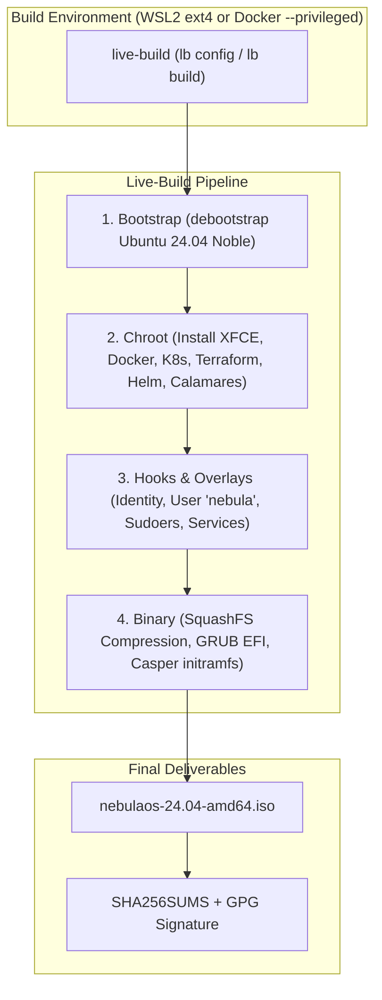

# NebulaOS: Custom Ubuntu Live & Installable DevOps Distro
### The Complete 14-Day Engineering Blueprint & Master Reference

NebulaOS is a specialized, production-ready live and installable Linux distribution tailored for DevOps practitioners, Cloud Architects, and Site Reliability Engineers (SREs). Built upon **Ubuntu 24.04 LTS (Noble Numbat)** using Debian's `live-build` tooling, it integrates the complete cloud toolchain (**Docker CE**, **Kubernetes `kubectl`**, **Terraform**, **Helm**, **Ansible**) with the **Calamares** graphical installer, full **UEFI Secure Boot** support, USB **persistence**, and a custom visual identity.

---

## Table of Contents

- [Architectural Overview](#architectural-overview)
- [Project Navigation (Day-by-Day Guides)](#project-navigation-day-by-day-guides)
- [WEEK 1: Foundation, Base ISO, Packages & Visual Branding](#week-1-foundation-base-iso-packages--visual-branding)
  - [Day 1: Build Environment Setup (WSL2 & Docker)](#day-1-build-environment-setup-wsl2--docker)
  - [Day 2: Live-Build Architecture & Auto Wrappers](#day-2-live-build-architecture--auto-wrappers)
  - [Day 3: Minimal Working Config Tree](#day-3-minimal-working-config-tree)
  - [Day 4: Building & Booting the Base ISO](#day-4-building--booting-the-base-iso)
  - [Day 5: DevOps Package Set & Third-Party Repositories](#day-5-devops-package-set--third-party-repositories)
  - [Day 6: Distro Identity, MOTD, Shell Prompt & Themes](#day-6-distro-identity-motd-shell-prompt--themes)
  - [Day 7: Calamares Installer Branding & Graphics](#day-7-calamares-installer-branding--graphics)
- [WEEK 2: Automation, Installer, Hardening & Release](#week-2-automation-installer-hardening--release)
  - [Day 8: Preconfiguration & User Permission Hooks](#day-8-preconfiguration--user-permission-hooks)
  - [Day 9: First-Boot Welcome Experience & Systemd Automation](#day-9-first-boot-welcome-experience--systemd-automation)
  - [Day 10: Calamares Installer Full Pipeline Configuration](#day-10-calamares-installer-full-pipeline-configuration)
  - [Day 11: Custom Repositories & Offline Readiness](#day-11-custom-repositories--offline-readiness)
  - [Day 12: Secure Boot MOK Signing & Persistent USB Storage](#day-12-secure-boot-mok-signing--persistent-usb-storage)
  - [Day 13: Comprehensive QA Testing Matrix & Troubleshooting](#day-13-comprehensive-qa-testing-matrix--troubleshooting)
  - [Day 14: Release Engineering, Checksums, GPG Signing & Flashing](#day-14-release-engineering-checksums-gpg-signing--flashing)

---

## Architectural Overview



---

## Project Navigation (Day-by-Day Guides)

In addition to this comprehensive reference, detailed standalone documentation for each day is provided:

| Week 1 | Guide Link | Focus Area |
| :--- | :--- | :--- |
| **Day 1** | [week1/day1.md](file:///F:/customUbuntu/week1/day1.md) | WSL2 native ext4 path setup, Docker `--privileged`, required apt packages |
| **Day 2** | [week1/day2.md](file:///F:/customUbuntu/week1/day2.md) | `live-build` 4-stage lifecycle, `auto/` wrapper scripts |
| **Day 3** | [week1/day3.md](file:///F:/customUbuntu/week1/day3.md) | Minimal package list (`casper`, `linux-generic`, `systemd`) |
| **Day 4** | [week1/day4.md](file:///F:/customUbuntu/week1/day4.md) | First test build, QEMU/VirtualBox VM verification, boot milestones |
| **Day 5** | [week1/day5.md](file:///F:/customUbuntu/week1/day5.md) | Third-party APT archives (Docker, K8s, Terraform, Helm) + GPG keys |
| **Day 6** | [week1/day6.md](file:///F:/customUbuntu/week1/day6.md) | Distro identity (`/etc/os-release`), custom MOTD, bash prompt, wallpaper |
| **Day 7** | [week1/day7.md](file:///F:/customUbuntu/week1/day7.md) | Calamares branding descriptor, dark Qt stylesheet, HTML slideshow |

| Week 2 | Guide Link | Focus Area |
| :--- | :--- | :--- |
| **Day 8** | [week2/day8.md](file:///F:/customUbuntu/week2/day8.md) | Chroot hooks: live user `nebula`, passwordless sudo, docker group, LightDM |
| **Day 9** | [week2/day9.md](file:///F:/customUbuntu/week2/day9.md) | Welcome script, systemd oneshot unit, desktop installer launcher |
| **Day 10** | [week2/day10.md](file:///F:/customUbuntu/week2/day10.md) | Calamares master `settings.conf`, partitioning, unpackfs, and bootloader |
| **Day 11** | [week2/day11.md](file:///F:/customUbuntu/week2/day11.md) | Local flat APT repo (`dpkg-scanpackages`), offline docs bundling |
| **Day 12** | [week2/day12.md](file:///F:/customUbuntu/week2/day12.md) | UEFI Secure Boot shim validation, MOK module signing, persistent USB |
| **Day 13** | [week2/day13.md](file:///F:/customUbuntu/week2/day13.md) | 8-point manual QA testing matrix, Casper boot failure log diagnostics |
| **Day 14** | [week2/day14.md](file:///F:/customUbuntu/week2/day14.md) | SHA-256 checksums, GPG detached signing, USB flashing (`dd`/Rufus), v0.1.0 release |

---

# WEEK 1: Foundation, Base ISO, Packages & Visual Branding

---

## Day 1: Build Environment Setup (WSL2 & Docker)

`live-build` performs root operations: creating loopback block devices (`losetup`), `debootstrap` chroot jails, and mounting virtual filesystems (`/proc`, `/sys`, `/dev`).

### Platform Rules:
- **WSL2 Users**: **DO NOT** build inside Windows mounts (`/mnt/c/`, `/mnt/f/`). The DrvFs translation layer breaks Linux POSIX permissions, symlinks, and `mknod`. Always build inside the WSL2 native ext4 path (e.g., `~/nebulaos-build`).
- **Docker Users**: The container **must** run with `--privileged` to access host loop devices.

### RUN THIS YOURSELF: Host Environment Preparation

```bash
# ==============================================================================
# 1. Update Package Manager & Install Toolchain
# ==============================================================================
sudo apt update && sudo apt install -y \
    live-build \
    debootstrap \
    squashfs-tools \
    xorriso \
    grub-pc-bin \
    grub-efi-amd64-bin \
    mtools \
    dosfstools \
    git \
    curl \
    gnupg \
    coreutils

# ==============================================================================
# 2. Initialize Dedicated Build Directory (WSL2 Native ext4)
# ==============================================================================
mkdir -p ~/nebulaos-build
cd ~/nebulaos-build
```

---

## Day 2: Live-Build Architecture & Auto Wrappers

Rather than typing manual parameters on every invocation, `live-build` provides an `auto/` wrapper directory. When you run `lb config`, `lb build`, or `lb clean`, it delegates to the corresponding script in `auto/`.

### RUN THIS YOURSELF: Create Auto Wrapper Scripts

```bash
mkdir -p auto

# 1. Create auto/config
cat << 'EOF' > auto/config
#!/bin/sh
set -e

lb config noauto \
    --mode ubuntu \
    --distribution noble \
    --architectures amd64 \
    --archive-areas "main restricted universe multiverse" \
    --linux-flavours generic \
    --bootloaders "grub-efi" \
    --binary-images iso-hybrid \
    --memtest none \
    --iso-application "NebulaOS Live & Installable DevOps Distro" \
    --iso-publisher "NebulaOS Project <https://nebulaos.dev>" \
    --iso-volume "NEBULAOS_2404" \
    --parent-mirror-bootstrap "http://archive.ubuntu.com/ubuntu/" \
    --parent-mirror-chroot "http://archive.ubuntu.com/ubuntu/" \
    --parent-mirror-binary "http://archive.ubuntu.com/ubuntu/" \
    --mirror-bootstrap "http://archive.ubuntu.com/ubuntu/" \
    --mirror-chroot "http://archive.ubuntu.com/ubuntu/" \
    --mirror-binary "http://archive.ubuntu.com/ubuntu/" \
    "${@}"
EOF
chmod +x auto/config

# 2. Create auto/build
cat << 'EOF' > auto/build
#!/bin/sh
set -e

lb build "${@}" 2>&1 | tee build.log
EOF
chmod +x auto/build

# 3. Create auto/clean
cat << 'EOF' > auto/clean
#!/bin/sh
set -e

lb clean --purge "${@}"
rm -f build.log
EOF
chmod +x auto/clean
```

---

## Day 3: Minimal Working Config Tree

Before layering the GUI and large DevOps tools, we define the minimal base live image containing Ubuntu's live-boot engine: `casper`.

### RUN THIS YOURSELF: Create Minimal Package Manifest

```bash
mkdir -p config/package-lists
mkdir -p config/includes.chroot/etc/apt/apt.conf.d

# Define core boot packages
cat << 'EOF' > config/package-lists/minimal.list.chroot
# Core Linux Kernel & Live Boot Engine
casper
discover
laptop-detect
os-prober
linux-generic

# Init System & Base Utilities
systemd
systemd-sysv
dbus
sudo
network-manager
net-tools
iproute2
iputils-ping
curl
wget
ca-certificates
nano
less
pciutils
usbutils
locales
tzdata
EOF

# Prevent APT from pulling recommended packages indiscriminately
echo 'APT::Install-Recommends "false";' > config/includes.chroot/etc/apt/apt.conf.d/99recommends
```

---

## Day 4: Building & Booting the Base ISO

### RUN THIS YOURSELF: Execute Minimal Build & Test in VM

```bash
# 1. Generate configuration and initiate build
sudo lb clean --purge
sudo lb config
sudo lb build 2>&1 | tee build.log

# 2. Rename generated ISO
if [ -f live-image-amd64.hybrid.iso ]; then
    mv live-image-amd64.hybrid.iso nebulaos-24.04-minimal-amd64.iso
    echo "SUCCESS: Created nebulaos-24.04-minimal-amd64.iso"
fi

# 3. Test in QEMU (if running on a Linux host with KVM/VNC)
# BIOS Test:
# qemu-system-x86_64 -m 2048 -smp 2 -cdrom nebulaos-24.04-minimal-amd64.iso -boot d -enable-kvm
# UEFI Test:
# qemu-system-x86_64 -m 2048 -smp 2 -bios /usr/share/ovmf/OVMF.fd -cdrom nebulaos-24.04-minimal-amd64.iso -boot d -enable-kvm
```

---

## Day 5: DevOps Package Set & Third-Party Repositories

We configure the external vendor repositories (**Docker**, **Kubernetes**, **HashiCorp**, **Helm**) with ASCII-armored GPG public keys in `config/archives/`, and define the desktop, devops, and installer package manifests.

### RUN THIS YOURSELF: Configure Archives and Package Lists

```bash
mkdir -p config/archives

# 1. Docker Official APT Repo & GPG Key
echo "deb [arch=amd64] https://download.docker.com/linux/ubuntu noble stable" > config/archives/docker.list.chroot
curl -fsSL https://download.docker.com/linux/ubuntu/gpg > config/archives/docker.key.chroot

# 2. Kubernetes Official APT Repo & GPG Key (v1.31)
echo "deb [arch=amd64] https://pkgs.k8s.io/core:/stable:/v1.31/deb/ /" > config/archives/kubernetes.list.chroot
curl -fsSL https://pkgs.k8s.io/core:/stable:/v1.31/deb/Release.key > config/archives/kubernetes.key.chroot

# 3. HashiCorp (Terraform) Official APT Repo & GPG Key
echo "deb [arch=amd64] https://apt.releases.hashicorp.com noble main" > config/archives/hashicorp.list.chroot
curl -fsSL https://apt.releases.hashicorp.com/gpg > config/archives/hashicorp.key.chroot

# 4. Helm Official APT Repo & GPG Key
echo "deb [arch=amd64] https://baltocdn.com/helm/stable/debian/ all main" > config/archives/helm.list.chroot
curl -fsSL https://baltocdn.com/helm/signing.asc > config/archives/helm.key.chroot

# ==============================================================================
# Package Lists
# ==============================================================================

# Desktop Environment (XFCE4 + LightDM)
cat << 'EOF' > config/package-lists/desktop.list.chroot
xfce4
xfce4-terminal
xfce4-taskmanager
thunar
mousepad
lightdm
lightdm-gtk-greeter
network-manager-gnome
pulseaudio
pavucontrol
firefox
zenity
EOF

# DevOps & Cloud Engineering Stack
cat << 'EOF' > config/package-lists/devops.list.chroot
docker-ce
docker-ce-cli
containerd.io
docker-buildx-plugin
docker-compose-plugin
kubectl
terraform
helm
ansible
git
curl
wget
jq
yq
tmux
htop
vim
nano
zsh
python3-pip
python3-venv
build-essential
tree
unzip
rsync
openssh-client
nmap
traceroute
tcpdump
net-tools
dnsutils
iproute2
wireguard-tools
EOF

# Calamares Graphical Installer
cat << 'EOF' > config/package-lists/installer.list.chroot
calamares
gparted
parted
dosfstools
e2fsprogs
btrfs-progs
xfsprogs
EOF
```

---

## Day 6: Distro Identity, MOTD, Shell Prompt & Themes

We rebrand the system from Ubuntu to **NebulaOS**: customize `/etc/os-release`, configure a branded MOTD banner with DevOps CLI status checks, craft a prompt with dynamic git branch detection, and install a custom SVG wallpaper.

### RUN THIS YOURSELF: Configure System Identity & Visuals

```bash
mkdir -p config/includes.chroot/etc/profile.d
mkdir -p config/includes.chroot/usr/share/backgrounds/nebulaos/
mkdir -p config/includes.chroot/usr/share/pixmaps/

# 1. Distro Definition (/etc/os-release)
cat << 'EOF' > config/includes.chroot/etc/os-release
NAME="NebulaOS"
VERSION="24.04 LTS (Noble Numbat)"
ID=nebulaos
ID_LIKE="ubuntu debian"
PRETTY_NAME="NebulaOS 24.04 LTS (DevOps Workstation)"
VERSION_ID="24.04"
HOME_URL="https://nebulaos.dev"
SUPPORT_URL="https://nebulaos.dev/support"
BUG_REPORT_URL="https://github.com/nebulaos/nebulaos/issues"
PRIVACY_POLICY_URL="https://nebulaos.dev/privacy"
VERSION_CODENAME=noble
UBUNTU_CODENAME=noble
LOGO=nebulaos-logo
EOF

cat << 'EOF' > config/includes.chroot/etc/issue
NebulaOS 24.04 LTS \n \l

EOF
cp config/includes.chroot/etc/issue config/includes.chroot/etc/issue.net

# 2. Custom DevOps MOTD Banner
cat << 'EOF' > config/includes.chroot/etc/motd
  _   _      _             _         ___  ____  
 | \ | | ___| |__  _   _  | | __ _  / _ \/ ___| 
 |  \| |/ _ \ '_ \| | | | | |/ _` || | | \___ \ 
 | |\  |  __/ |_) | |_| | | | (_| || |_| |___) |
 |_| \_|\___|_.__/ \__,_| |_|\__,_| \___/|____/ 
 NebulaOS 24.04 LTS — Cloud & DevOps Workstation

 Available DevOps Tooling:
   docker    : $(docker --version 2>/dev/null || echo "installed")
   kubectl   : $(kubectl version --client --output=yaml 2>/dev/null | grep gitVersion | awk '{print $2}' || echo "installed")
   terraform : $(terraform version 2>/dev/null | head -n1 || echo "installed")
   helm      : $(helm version --short 2>/dev/null || echo "installed")
   ansible   : $(ansible --version 2>/dev/null | head -n1 || echo "installed")

 Double-click 'Install NebulaOS' on the desktop to install permanently.
EOF

# 3. Dynamic Git-Aware Shell Prompt
cat << 'EOF' > config/includes.chroot/etc/profile.d/nebulaos-prompt.sh
parse_git_branch() {
    git branch 2> /dev/null | sed -e '/^[^*]/d' -e 's/* \(.*\)/ (\1)/'
}
if [ "$USER" = "root" ]; then
    PS1='\[\033[01;31m\]\u@\h\[\033[00m\]:\[\033[01;34m\]\w\[\033[01;33m\]$(parse_git_branch)\[\033[00m\]# '
else
    PS1='\[\033[01;36m\]\u@nebulaos\[\033[00m\]:\[\033[01;34m\]\w\[\033[01;33m\]$(parse_git_branch)\[\033[00m\]$ '
fi
EOF
chmod +x config/includes.chroot/etc/profile.d/nebulaos-prompt.sh

# 4. Desktop Wallpaper & Pixmap Logo
cat << 'EOF' > config/includes.chroot/usr/share/backgrounds/nebulaos/nebulaos-wallpaper.svg
<svg xmlns="http://www.w3.org/2000/svg" width="1920" height="1080" viewBox="0 0 1920 1080">
  <defs>
    <linearGradient id="bg" x1="0%" y1="0%" x2="100%" y2="100%">
      <stop offset="0%" stop-color="#0a0e17" />
      <stop offset="50%" stop-color="#111927" />
      <stop offset="100%" stop-color="#0f172a" />
    </linearGradient>
    <linearGradient id="accent" x1="0%" y1="0%" x2="100%" y2="0%">
      <stop offset="0%" stop-color="#00f2fe" />
      <stop offset="100%" stop-color="#4facfe" />
    </linearGradient>
  </defs>
  <rect width="1920" height="1080" fill="url(#bg)" />
  <circle cx="960" cy="540" r="320" fill="none" stroke="url(#accent)" stroke-width="2" opacity="0.3" />
  <circle cx="960" cy="540" r="260" fill="none" stroke="url(#accent)" stroke-width="1.5" stroke-dasharray="10 15" opacity="0.4" />
  <text x="960" y="530" font-family="sans-serif" font-size="64" font-weight="bold" fill="#ffffff" text-anchor="middle" letter-spacing="4">NebulaOS</text>
  <text x="960" y="580" font-family="sans-serif" font-size="20" fill="#00f2fe" text-anchor="middle" letter-spacing="8">CLOUD &amp; DEVOPS WORKSTATION</text>
</svg>
EOF
cp config/includes.chroot/usr/share/backgrounds/nebulaos/nebulaos-wallpaper.svg \
   config/includes.chroot/usr/share/pixmaps/nebulaos-logo.svg
```

---

## Day 7: Calamares Installer Branding & Graphics

We configure Calamares's descriptor, dark stylesheet, and slideshow.

### RUN THIS YOURSELF: Configure Calamares Branding

```bash
mkdir -p config/includes.chroot/etc/calamares/branding/nebulaos/slideshow

# 1. Branding Descriptor
cat << 'EOF' > config/includes.chroot/etc/calamares/branding/nebulaos/branding.desc
---
componentName: nebulaos
welcomeStyleCalamares: false
welcomeExpandingLogo: true
windowExpanding: normal
windowSize: 850px,560px
windowPlacement: center

strings:
    productName:         "NebulaOS"
    shortProductName:    "NebulaOS"
    version:             "24.04 LTS"
    shortVersion:        "24.04"
    versionedName:       "NebulaOS 24.04 LTS"
    shortVersionedName:  "NebulaOS 24.04"
    bootloaderEntryName: "NebulaOS"
    productUrl:          "https://nebulaos.dev"
    supportUrl:          "https://nebulaos.dev/support"
    bugReportUrl:        "https://github.com/nebulaos/nebulaos/issues"
    releaseNotesUrl:     "https://nebulaos.dev/releases/24.04"

images:
    productLogo:         "nebulaos-logo.svg"
    productIcon:         "nebulaos-logo.svg"
    productWelcome:      "nebulaos-logo.svg"

slideshow:               "slideshow.qml"

style:
   SidebarBackground:    "#0a0e17"
   SidebarText:          "#ffffff"
   SidebarTextCurrent:   "#00f2fe"
   SidebarBackgroundCurrent: "#111927"
EOF

# 2. Qt Dark Stylesheet
cat << 'EOF' > config/includes.chroot/etc/calamares/branding/nebulaos/stylesheet.qss
QWidget {
    background-color: #0f172a;
    color: #e2e8f0;
    font-family: "DejaVu Sans", "Sans Serif";
    font-size: 13px;
}
QDialog, QMainWindow { background-color: #0a0e17; }
#sidebarApp { background-color: #0a0e17; border-right: 1px solid #1e293b; padding: 12px; }
QPushButton {
    background-color: #1e293b; border: 1px solid #334155; border-radius: 4px;
    padding: 8px 18px; color: #ffffff; font-weight: bold;
}
QPushButton:hover { background-color: #00f2fe; color: #0a0e17; border: 1px solid #00f2fe; }
QPushButton:pressed { background-color: #0284c7; color: #ffffff; }
QProgressBar { background-color: #1e293b; border: 1px solid #334155; border-radius: 4px; text-align: center; color: #ffffff; height: 18px; }
QProgressBar::chunk { background-color: #00f2fe; border-radius: 3px; }
QLineEdit, QComboBox { background-color: #1e293b; border: 1px solid #334155; border-radius: 4px; padding: 6px; color: #ffffff; }
QLineEdit:focus, QComboBox:focus { border: 1px solid #00f2fe; }
EOF

# 3. Slideshow Cards
cat << 'EOF' > config/includes.chroot/etc/calamares/branding/nebulaos/slideshow/slide1.html
<!DOCTYPE html>
<html>
<head><style>body { background-color: #0f172a; color: #f8fafc; font-family: sans-serif; padding: 40px; } h1 { color: #00f2fe; font-size: 30px; }</style></head>
<body>
  <h1>Welcome to NebulaOS</h1>
  <p>Engineered specifically for DevOps practitioners, cloud architects, and site reliability engineers.</p>
</body>
</html>
EOF

cat << 'EOF' > config/includes.chroot/etc/calamares/branding/nebulaos/slideshow/slide2.html
<!DOCTYPE html>
<html>
<head><style>body { background-color: #0f172a; color: #f8fafc; font-family: sans-serif; padding: 40px; } h1 { color: #00f2fe; font-size: 30px; } li { font-size: 16px; line-height: 1.8; color: #cbd5e1; }</style></head>
<body>
  <h1>Built-in Tooling</h1>
  <ul>
    <li>Docker Engine &amp; Compose (Non-root user ready)</li>
    <li>Kubernetes (kubectl v1.31) &amp; Helm</li>
    <li>Terraform &amp; Ansible</li>
  </ul>
</body>
</html>
EOF

cp config/includes.chroot/usr/share/backgrounds/nebulaos/nebulaos-wallpaper.svg \
   config/includes.chroot/etc/calamares/branding/nebulaos/nebulaos-logo.svg
```

---

# WEEK 2: Automation, Installer, Hardening & Release

---

## Day 8: Preconfiguration & User Permission Hooks

Scripts in `config/hooks/live/` run inside the chroot before filesystem compression. We configure the default user `nebula`, grant passwordless sudo for the live session, assign the `docker` group, and enable systemd daemons.

### RUN THIS YOURSELF: Create Live Chroot Hooks

```bash
mkdir -p config/hooks/live

# 1. User & Permission Hook
cat << 'EOF' > config/hooks/live/01-user-setup.hook.chroot
#!/bin/sh
set -e
echo "=== NebulaOS Hook: Configuring Live User ==="

if ! id -u nebula >/dev/null 2>&1; then
    useradd -m -s /bin/bash -c "NebulaOS Live User" -G sudo,adm,dialout,cdrom,plugdev,netdev nebula
    echo "nebula:nebula" | chpasswd
fi

groupadd -f docker
usermod -aG docker nebula

mkdir -p /etc/sudoers.d
echo "nebula ALL=(ALL) NOPASSWD: ALL" > /etc/sudoers.d/99-nebula-live
chmod 0440 /etc/sudoers.d/99-nebula-live

mkdir -p /etc/lightdm/lightdm.conf.d
cat << 'LIGHTDM_EOF' > /etc/lightdm/lightdm.conf.d/80-nebula-autologin.conf
[Seat:*]
autologin-user=nebula
autologin-user-timeout=0
user-session=xfce
LIGHTDM_EOF
EOF
chmod +x config/hooks/live/01-user-setup.hook.chroot

# 2. Services Hook
cat << 'EOF' > config/hooks/live/02-services-setup.hook.chroot
#!/bin/sh
set -e
echo "=== NebulaOS Hook: Enabling System Daemons ==="

systemctl enable NetworkManager.service || true
systemctl enable docker.service || true
systemctl enable containerd.service || true
systemctl enable lightdm.service || true
systemctl mask sleep.target suspend.target hibernate.target hybrid-sleep.target || true
EOF
chmod +x config/hooks/live/02-services-setup.hook.chroot
```

---

## Day 9: First-Boot Welcome Experience & Systemd Automation

We set up a desktop icon to launch Calamares and an automated first-boot welcome notification.

### RUN THIS YOURSELF: Desktop Launcher & Welcome Unit

```bash
mkdir -p config/includes.chroot/etc/skel/Desktop/
mkdir -p config/includes.chroot/usr/local/bin
mkdir -p config/includes.chroot/etc/systemd/system

# 1. Calamares Desktop Icon
cat << 'EOF' > config/includes.chroot/etc/skel/Desktop/install-nebulaos.desktop
[Desktop Entry]
Type=Application
Version=1.0
Name=Install NebulaOS
GenericName=Live System Installer
Comment=Install NebulaOS permanently to your hard disk
Exec=pkexec calamares
Icon=calamares
Terminal=false
Categories=System;
StartupNotify=true
EOF
chmod +x config/includes.chroot/etc/skel/Desktop/install-nebulaos.desktop

# 2. Welcome Script
cat << 'EOF' > config/includes.chroot/usr/local/bin/nebulaos-welcome.sh
#!/bin/bash
if [ -f /var/run/nebulaos-welcomed ]; then exit 0; fi
touch /var/run/nebulaos-welcomed
if [ -n "$DISPLAY" ] && command -v zenity >/dev/null 2>&1; then
    zenity --info --title="Welcome to NebulaOS 24.04 LTS" \
        --width=450 --height=220 \
        --text="<b>Welcome to NebulaOS!</b>\n\nYour specialized DevOps & Cloud Engineering workstation.\n\n• Docker & Containerd: Active (non-root ready)\n• Kubernetes & Helm: Ready out-of-the-box\n• Terraform & Ansible: Pre-installed\n\nDouble-click <b>Install NebulaOS</b> on the desktop to install to disk."
fi
EOF
chmod +x config/includes.chroot/usr/local/bin/nebulaos-welcome.sh

# 3. Systemd Oneshot Service
cat << 'EOF' > config/includes.chroot/etc/systemd/system/nebulaos-firstboot.service
[Unit]
Description=NebulaOS First-Boot Initialization
After=network.target lightdm.service

[Service]
Type=oneshot
RemainAfterExit=yes
ExecStart=/usr/local/bin/nebulaos-welcome.sh

[Install]
WantedBy=graphical.target
EOF

# 4. Live Desktop Sync Hook
cat << 'EOF' > config/hooks/live/03-desktop-setup.hook.chroot
#!/bin/sh
set -e
if id -u nebula >/dev/null 2>&1; then
    mkdir -p /home/nebula/Desktop
    cp /etc/skel/Desktop/install-nebulaos.desktop /home/nebula/Desktop/
    chown -R nebula:nebula /home/nebula/Desktop
    chmod +x /home/nebula/Desktop/install-nebulaos.desktop
fi
systemctl enable nebulaos-firstboot.service || true
EOF
chmod +x config/hooks/live/03-desktop-setup.hook.chroot
```

---

## Day 10: Calamares Installer Full Pipeline Configuration

We configure the master `settings.conf` and modules for partitioning, unpacking the squashfs, user configuration, and GRUB EFI bootloader installation.

### RUN THIS YOURSELF: Configure Calamares Pipeline

```bash
mkdir -p config/includes.chroot/etc/calamares/modules

# 1. Master Settings Orchestration
cat << 'EOF' > config/includes.chroot/etc/calamares/settings.conf
---
modules-search: [ local, /usr/lib/x86_64-linux-gnu/calamares/modules ]

instances:
- id:       clean_live_user
  module:   shellprocess
  config:   shellprocess_remove_live.conf

sequence:
- show:
  - welcome
  - locale
  - keyboard
  - partition
  - users
  - summary
- exec:
  - partition
  - mount
  - unpackfs
  - machineid
  - fstab
  - locale
  - keyboard
  - localecfg
  - users
  - networkcfg
  - hwclock
  - services-systemd
  - bootloader
  - shellprocess@clean_live_user
  - umount
- show:
  - finished

branding: nebulaos
prompt-install: false
dont-chroot: false
oem-setup: false
EOF

# 2. Welcome Pre-check Module
cat << 'EOF' > config/includes.chroot/etc/calamares/modules/welcome.conf
---
showSupportUrl:      true
showReleaseNotesUrl: true
requirements:
    requiredStorage: 20.0
    requiredRam:     2.0
    check:
        - storage
        - ram
        - power
    required:
        - storage
        - ram
EOF

# 3. Partitioning Module (GPT + EFI default)
cat << 'EOF' > config/includes.chroot/etc/calamares/modules/partition.conf
---
efiSystemPartition:     "/boot/efi"
efiSystemPartitionSize: 512M
defaultFileSystemType:  "ext4"
availableFileSystemTypes: ["ext4", "btrfs", "xfs"]
enableLuksAutomatedPartitioning: true
defaultPartitionTableType: "gpt"
initialPartitioningChoice: erase
initialSwapChoice:      small
EOF

# 4. User Accounts Module
cat << 'EOF' > config/includes.chroot/etc/calamares/modules/users.conf
---
defaultGroups:
    - sudo
    - docker
    - adm
    - cdrom
    - plugdev
    - netdev
autologinGroup: autologin
doAutologin:    false
sudoersGroup:   sudo
setRootPassword: false
doReusePassword: true
EOF

# 5. Filesystem Unpack Module
cat << 'EOF' > config/includes.chroot/etc/calamares/modules/unpackfs.conf
---
unpack:
    - source: "/run/live/medium/casper/filesystem.squashfs"
      sourcefs: "squashfs"
      destination: ""
EOF

# 6. GRUB EFI Bootloader Module
cat << 'EOF' > config/includes.chroot/etc/calamares/modules/bootloader.conf
---
efiBootLoader: "grub"
kernel: "/vmlinuz"
img: "/initrd.img"
stage1: "/boot/efi"
installEpilogue: true
grubInstall: "grub-install"
grubMkconfig: "grub-mkconfig"
grubCfgPath: "/boot/grub/grub.cfg"
grubProbe: "grub-probe"
efiBootMgr: "efibootmgr"
EOF

# 7. Post-Install Cleanup (Purge live user from target disk)
cat << 'EOF' > config/includes.chroot/etc/calamares/modules/shellprocess_remove_live.conf
---
dontChroot: false
timeout: 30
script:
    - "-rm -f /etc/sudoers.d/99-nebula-live"
    - "-rm -f /etc/lightdm/lightdm.conf.d/80-nebula-autologin.conf"
    - "-userdel -r -f nebula"
EOF
```

---

## Day 11: Custom Repositories & Offline Readiness

For offline readiness, we bundle offline quickstarts into `/usr/share/doc/nebulaos/`. If you have local `.deb` files, place them in `config/packages.chroot/`.

### RUN THIS YOURSELF: Bundle Offline Documentation

```bash
mkdir -p config/packages.chroot/
mkdir -p config/includes.chroot/usr/share/doc/nebulaos/

cat << 'EOF' > config/includes.chroot/usr/share/doc/nebulaos/DEVOPS_QUICKSTART.md
# NebulaOS Offline Quickstart Reference

## Docker CLI
- Status: `sudo systemctl status docker`
- Run container: `docker run -d --name web -p 8080:80 nginx:alpine`
- Compose up: `docker compose up -d`

## Kubernetes (kubectl)
- Context view: `kubectl config get-contexts`
- Cluster info: `kubectl cluster-info`
- Run pod: `kubectl run test --image=busybox --restart=Never -- sleep 3600`

## Terraform
- Init: `terraform init`
- Plan: `terraform plan -out=tfplan`
- Apply: `terraform apply tfplan`
EOF
```

---

## Day 12: Secure Boot MOK Signing & Persistent USB Storage

### 1. Secure Boot Verification
Because NebulaOS uses Ubuntu's signed `shim-signed` (`shimx64.efi`) and Canonical-signed kernel, it boots under UEFI Secure Boot out-of-the-box.

### 2. Signing Out-of-Tree Modules with MOK
If building proprietary DKMS kernel modules:
```bash
# Generate MOK key and enroll in NVRAM
openssl req -new -x509 -newkey rsa:2048 -keyout MOK.priv -outform DER -out MOK.der -nodes -days 3650 -subj "/CN=NebulaOS Module Key/"
sudo mokutil --import MOK.der
```

### 3. USB Live Persistence Setup
To persist live sessions across reboots on a USB stick (`/dev/sdb`):
```bash
# 1. Burn ISO to USB
sudo dd if=nebulaos-24.04-amd64.iso of=/dev/sdb bs=4M status=progress conv=fsync

# 2. Create and format persistent partition
sudo parted /dev/sdb --script mkpart primary ext4 4000MB 100%
sudo mkfs.ext4 -F -L casper-rw /dev/sdb3

# Boot USB, press 'e' in GRUB, and append: persistent
```

### 4. GPG Release Key Generation
```bash
gpg --batch --gen-key << 'EOF'
Key-Type: RSA
Key-Length: 4096
Name-Real: NebulaOS Release Signing Authority
Name-Email: release@nebulaos.dev
Expire-Date: 2y
%no-protection
%commit
EOF
gpg --armor --export release@nebulaos.dev > nebulaos-release.asc
```

---

## Day 13: Comprehensive QA Testing Matrix & Troubleshooting

### QA Validation Matrix:
1. **BIOS Boot**: VM Legacy BIOS mode loads GRUB and launches XFCE.
2. **UEFI Boot**: VM UEFI (OVMF) loads GRUB EFI cleanly.
3. **Secure Boot**: Boots without policy errors on Secure Boot hardware.
4. **Branding**: `cat /etc/os-release` displays NebulaOS; prompt shows `nebula@nebulaos`.
5. **Toolchain**: `docker --version`, `kubectl`, `terraform`, `helm`, `ansible` all report valid versions.
6. **Docker Non-Root**: `docker run --rm hello-world` executes without `sudo`.
7. **Calamares**: Successfully installs to hard drive and boots upon reboot.
8. **Persistence**: Files created in `/home/nebula` survive reboot on persistent USB.

### Boot Failure Troubleshooting:
- `(initramfs) Unable to find a medium containing a live file system`: Check `cat /var/log/casper.log`. Ensure USB was written with `dd` raw image mode.
- `Kernel panic - not syncing: VFS: Unable to mount root fs`: Ensure `casper` and `linux-generic` are in `config/package-lists/minimal.list.chroot`.
- Desktop hangs at black screen: Press `Ctrl + Alt + F2`, log in as `nebula`, check `journalctl -u lightdm.service`.

---

## Day 14: Release Engineering, Checksums, GPG Signing & Flashing

### RUN THIS YOURSELF: Package, Sign, and Tag Release

```bash
# 1. Build Final Production ISO
sudo lb clean --purge
sudo lb config
sudo lb build 2>&1 | tee build.log

mv live-image-amd64.hybrid.iso nebulaos-24.04-amd64.iso

# 2. Generate Checksums and Sign
sha256sum nebulaos-24.04-amd64.iso > SHA256SUMS
gpg --armor --detach-sign --output SHA256SUMS.gpg SHA256SUMS

# 3. Verify Signature
gpg --verify SHA256SUMS.gpg SHA256SUMS

# 4. Git Release Milestone
git init
git add .
git commit -m "release: NebulaOS v0.1.0 production live-build recipe"
git tag -s v0.1.0 -m "NebulaOS v0.1.0 - Ubuntu 24.04 LTS Noble DevOps Distro"
```

### End-User USB Flashing:
- **GUI**: Use [balenaEtcher](https://etcher.balena.io/) or [Rufus](https://rufus.ie/) (Write in DD Image mode).
- **CLI**:
  ```bash
  sudo dd if=nebulaos-24.04-amd64.iso of=/dev/sdX bs=4M status=progress conv=fsync
  ```

---

## Summary of Deliverables

- Complete **Day 1 to Day 14** implementation guide embedded directly in this [README.md](file:///F:/customUbuntu/README.md).
- Dedicated individual day files available under `week1/` and `week2/`.
- Ready for immediate execution in WSL2 or Docker!
