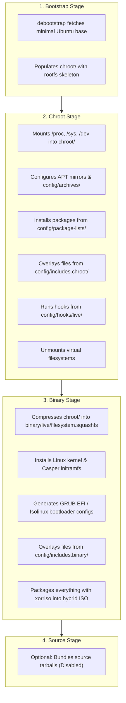

# NebulaOS Build Plan — Week 1, Day 2: Live-Build Architecture & Configuration Anatomy

## Objective
Understand the inner workings of `live-build`, its configuration directory structure, and how `auto/` wrapper scripts make the build 100% reproducible.

---

## 1. The Four Phases of `lb build`

When you invoke `lb build`, `live-build` steps through four discrete stages:



---

## 2. Directory Hierarchy Explained

A clean `live-build` project separates instructions into two primary folders: `auto/` and `config/`.

```text
nebulaos/
├── auto/
│   ├── config          # Shell script defining default lb config flags
│   ├── build           # Shell script executing lb build
│   └── clean           # Shell script executing lb clean
└── config/
    ├── archives/       # Third-party repositories (.list.chroot) and GPG keys (.key.chroot)
    ├── includes.chroot/# Root overlay (copied directly into / of the target OS)
    ├── includes.binary/# Binary overlay (copied directly to the root of the ISO image)
    ├── package-lists/  # Text files (*.list.chroot) defining packages to install
    ├── hooks/
    │   └── live/       # Shell scripts (*.hook.chroot) executed inside chroot before squashfs
    ├── common          # Generated global variables
    ├── bootstrap       # Generated debootstrap parameters
    ├── chroot          # Generated chroot environment parameters
    └── binary          # Generated binary ISO parameters
```

### Purpose of Key Directories

1. **`auto/config`**:
   Instead of typing a 200-character `lb config` command manually every time, you place it inside `auto/config`. When you run `lb config`, it delegates to `auto/config "$@"`.
2. **`config/package-lists/*.list.chroot`**:
   Any file ending in `.list.chroot` contains package names (one per line). Comments `#` and blank lines are ignored.
3. **`config/includes.chroot/`**:
   The filesystem overlay. For instance, if you create `config/includes.chroot/etc/os-release`, it will be copied directly to `/etc/os-release` inside the ISO filesystem, overriding Ubuntu's default.
4. **`config/hooks/live/*.hook.chroot`**:
   Executable scripts run inside the target system at the very end of the chroot stage. Used for configuring users, modifying default desktop settings, and enabling systemd units.
5. **`config/archives/*.list.chroot` & `*.key.chroot`**:
   Custom APT sources. `foo.list.chroot` contains the repo URL, and `foo.key.chroot` contains the ASCII-armored GPG public key.

---

## 3. Initializing the Base Configuration

To make `live-build` use reproducible settings, we create `auto/config`.

### RUN THIS YOURSELF: Create Auto Wrapper Scripts

Inside your build directory (`~/nebulaos-build`):

```bash
mkdir -p auto

# 1. Create auto/config
cat << 'EOF' > auto/config
#!/bin/sh
set -e

lb config noauto \
    --mode ubuntu \
    --distribution noble \
    --architectures amd64 \
    --archive-areas "main restricted universe multiverse" \
    --linux-flavours generic \
    --bootloaders "grub-efi" \
    --binary-images iso-hybrid \
    --memtest none \
    --iso-application "NebulaOS Live & Installable DevOps Distro" \
    --iso-publisher "NebulaOS Project <https://nebulaos.dev>" \
    --iso-volume "NEBULAOS_2404" \
    --parent-mirror-bootstrap "http://archive.ubuntu.com/ubuntu/" \
    --parent-mirror-chroot "http://archive.ubuntu.com/ubuntu/" \
    --parent-mirror-binary "http://archive.ubuntu.com/ubuntu/" \
    --mirror-bootstrap "http://archive.ubuntu.com/ubuntu/" \
    --mirror-chroot "http://archive.ubuntu.com/ubuntu/" \
    --mirror-binary "http://archive.ubuntu.com/ubuntu/" \
    "${@}"
EOF

chmod +x auto/config

# 2. Create auto/build
cat << 'EOF' > auto/build
#!/bin/sh
set -e

lb build "${@}" 2>&1 | tee build.log
EOF

chmod +x auto/build

# 3. Create auto/clean
cat << 'EOF' > auto/clean
#!/bin/sh
set -e

lb clean --purge "${@}"
rm -f build.log
EOF

chmod +x auto/clean
```

---

## 4. Verification

Run:
```bash
lb config
```
You will notice the `config/` directory is automatically generated with `config/common`, `config/bootstrap`, `config/chroot`, and `config/binary`.

---

## Next Step
Proceed to [Day 3: Setting Up Minimal Working Config Tree](file:///F:/customUbuntu/week1/day3.md).
