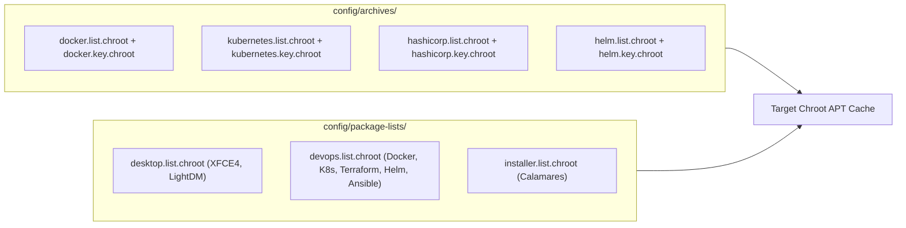

# NebulaOS Build Plan — Week 1, Day 5: DevOps Package Set & Third-Party Repositories

## Objective
Configure third-party APT repositories (`config/archives/`) with their respective GPG verification keys, and define the complete package manifests for the desktop environment, DevOps toolchain, and installer.

---

## 1. Third-Party Repository Architecture

Ubuntu's official repositories provide `ansible`, `git`, `tmux`, and `vim`. However, production-grade cloud tools—**Docker CE**, **Kubernetes (`kubectl`)**, **Terraform**, and **Helm**—are maintained in upstream vendor repositories.

In `live-build`, external repositories are wired via two files per repository:
- `config/archives/<name>.list.chroot`: The APT source line.
- `config/archives/<name>.key.chroot`: The ASCII-armored GPG public key used to verify package signatures.



---

## 2. Setting Up Third-Party APT Repositories & GPG Keys

### RUN THIS YOURSELF: Configure `config/archives/`

Execute this in `~/nebulaos-build`:

```bash
mkdir -p config/archives

# ==============================================================================
# 1. Docker Official Repository
# ==============================================================================
echo "deb [arch=amd64] https://download.docker.com/linux/ubuntu noble stable" \
    > config/archives/docker.list.chroot

# Download Docker ASCII-armored GPG Key
curl -fsSL https://download.docker.com/linux/ubuntu/gpg \
    > config/archives/docker.key.chroot

# ==============================================================================
# 2. Kubernetes Official Repository (pkgs.k8s.io v1.31)
# ==============================================================================
echo "deb [arch=amd64] https://pkgs.k8s.io/core:/stable:/v1.31/deb/ /" \
    > config/archives/kubernetes.list.chroot

# Download Kubernetes ASCII-armored GPG Key
curl -fsSL https://pkgs.k8s.io/core:/stable:/v1.31/deb/Release.key \
    > config/archives/kubernetes.key.chroot

# ==============================================================================
# 3. HashiCorp Official Repository (Terraform)
# ==============================================================================
echo "deb [arch=amd64] https://apt.releases.hashicorp.com noble main" \
    > config/archives/hashicorp.list.chroot

# Download HashiCorp ASCII-armored GPG Key
curl -fsSL https://apt.releases.hashicorp.com/gpg \
    > config/archives/hashicorp.key.chroot

# ==============================================================================
# 4. Helm Official Repository
# ==============================================================================
echo "deb [arch=amd64] https://baltocdn.com/helm/stable/debian/ all main" \
    > config/archives/helm.list.chroot

# Download Helm ASCII-armored GPG Key
curl -fsSL https://baltocdn.com/helm/signing.asc \
    > config/archives/helm.key.chroot
```

---

## 3. Defining Package Lists

We organize packages into three logical manifests in `config/package-lists/`:
1. `desktop.list.chroot`: Lightweight XFCE desktop environment, terminal, display manager.
2. `devops.list.chroot`: Complete cloud engineering stack.
3. `installer.list.chroot`: Calamares graphical installer and disk partitioning tools.

### RUN THIS YOURSELF: Create Package Lists

```bash
# ==============================================================================
# 1. Desktop & Display Environment
# ==============================================================================
cat << 'EOF' > config/package-lists/desktop.list.chroot
# XFCE Core & Compositor
xfce4
xfce4-terminal
xfce4-taskmanager
thunar
mousepad
lightdm
lightdm-gtk-greeter

# Networking & Audio
network-manager-gnome
pulseaudio
pavucontrol

# Web & Tools
firefox
firefox-locale-en
EOF

# ==============================================================================
# 2. DevOps & Cloud Engineering Toolchain
# ==============================================================================
cat << 'EOF' > config/package-lists/devops.list.chroot
# Docker Engine & Compose
docker-ce
docker-ce-cli
containerd.io
docker-buildx-plugin
docker-compose-plugin

# Kubernetes & Infrastructure as Code
kubectl
terraform
helm
ansible

# Cloud & Network Diagnostic Tools
git
curl
wget
jq
yq
tmux
htop
vim
nano
zsh
python3-pip
python3-venv
build-essential
tree
unzip
rsync
openssh-client
nmap
traceroute
tcpdump
net-tools
dnsutils
iproute2
wireguard-tools
EOF

# ==============================================================================
# 3. Calamares Installer & Partitioning
# ==============================================================================
cat << 'EOF' > config/package-lists/installer.list.chroot
calamares
gparted
parted
dosfstools
e2fsprogs
btrfs-progs
xfsprogs
EOF
```

---

## 4. Verification

Verify that all files are correctly populated:
```bash
ls -l config/archives/
ls -l config/package-lists/
```
Confirm that none of the `*.key.chroot` files are empty (they should each contain `-----BEGIN PGP PUBLIC KEY BLOCK-----`).

---

## Next Step
Proceed to [Day 6: Distro Identity, Custom MOTD, Prompt & Themes](file:///F:/customUbuntu/week1/day6.md).
