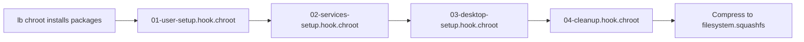

# NebulaOS Build Plan — Week 2, Day 8: Preconfiguration & User Hooks

## Objective
Write live-build chroot hook scripts in `config/hooks/live/` to automate default user creation (`nebula`), passwordless sudo for the live environment, adding the user to the `docker` group, and enabling core systemd services.

---

## 1. How Chroot Hooks Work in `live-build`

Any executable script placed in `config/hooks/live/*.hook.chroot` runs inside the chroot jail near the end of the `lb chroot` stage, just before package caches are cleaned and the rootfs is compressed into `filesystem.squashfs`.

Rules for hooks:
- Must have executable permissions (`chmod +x`).
- Must run non-interactively without user prompts.
- Runs with root privileges inside the chroot.



---

## 2. Default User & Sudoers Hook (`01-user-setup.hook.chroot`)

We configure the default live user:
- **Username**: `nebula`
- **Groups**: `sudo`, `docker`, `adm`, `dialout`, `cdrom`, `plugdev`, `netdev`
- **Sudoers**: Passwordless sudo in the live session so engineers can run Docker and install commands without hindrance.

### RUN THIS YOURSELF: Create User Hook
Inside `~/nebulaos-build`:

```bash
mkdir -p config/hooks/live

cat << 'EOF' > config/hooks/live/01-user-setup.hook.chroot
#!/bin/sh
set -e

echo "=== NebulaOS Hook: Configuring Default Live User ==="

# 1. Create nebula user if not already present
if ! id -u nebula >/dev/null 2>&1; then
    useradd -m -s /bin/bash -c "NebulaOS Live User" -G sudo,adm,dialout,cdrom,plugdev,netdev nebula
    echo "nebula:nebula" | chpasswd
fi

# 2. Ensure docker group exists and add nebula user to it
groupadd -f docker
usermod -aG docker nebula

# 3. Grant passwordless sudo to live user
mkdir -p /etc/sudoers.d
cat << 'SUDO_EOF' > /etc/sudoers.d/99-nebula-live
nebula ALL=(ALL) NOPASSWD: ALL
SUDO_EOF
chmod 0440 /etc/sudoers.d/99-nebula-live

# 4. Configure LightDM auto-login for live session
if [ -d /etc/lightdm/lightdm.conf.d ]; then
    cat << 'LIGHTDM_EOF' > /etc/lightdm/lightdm.conf.d/80-nebula-autologin.conf
[Seat:*]
autologin-user=nebula
autologin-user-timeout=0
user-session=xfce
LIGHTDM_EOF
fi

echo "=== User configuration complete ==="
EOF

chmod +x config/hooks/live/01-user-setup.hook.chroot
```

---

## 3. System Services Hook (`02-services-setup.hook.chroot`)

Ensures that Docker, NetworkManager, and LightDM services are enabled to start automatically on system boot.

### RUN THIS YOURSELF: Create Services Hook
```bash
cat << 'EOF' > config/hooks/live/02-services-setup.hook.chroot
#!/bin/sh
set -e

echo "=== NebulaOS Hook: Enabling Systemd Services ==="

# Enable essential system daemons
systemctl enable NetworkManager.service || true
systemctl enable docker.service || true
systemctl enable containerd.service || true
systemctl enable lightdm.service || true

# Disable unnecessary sleep / hibernate on live media
systemctl mask sleep.target suspend.target hibernate.target hybrid-sleep.target || true

echo "=== Services configured successfully ==="
EOF

chmod +x config/hooks/live/02-services-setup.hook.chroot
```

---

## 4. Verification

Verify that both hooks are executable:
```bash
ls -l config/hooks/live/
```
Both files must show `-rwxr-xr-x`.

---

## Next Step
Proceed to [Day 9: First-Boot Welcome Experience & Systemd Automation](file:///F:/customUbuntu/week2/day9.md).
